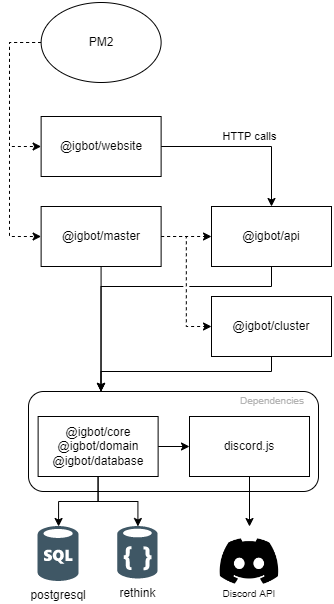

# IG Bot

  

This Discord bot is supposed to ease the management of students-based Discord guilds for the [Henallux](https://henallux.be). It is **not** related of any manner to the Henallux.

## Features list

An non-exhaustive list of features is available on [GitHub](https://github.com/Section-IG/IGBot/issues/12).

## Design

| Repository name | Language   | Technologies         |
| --------------- | ---------- | -------------------- |
| @igbot/website  | TypeScript | React                |
| @igbot/master   | TypeScript | DiscordJS            |
| @igbot/api      | TypeScript | DiscordJS, ExpressJS |
| @igbot/cluster  | TypeScript | DiscordJS            |
| @igbot/core     | TypeScript | DiscordJS            |
| @igbot/domain   | TypeScript | DiscordJS            |
| @igbot/database | TypeScript | Prisma               |

### @igbot/website

The website is a dashboard-like single page application that helps configuring the bot as an admin.
It is also a good tool for normal users to consult their guilds' statistics and see a leaderboard on the activity of the users on it.

It is built with React in TypeScript and communicates with the rest of the system through the API.

### @igbot/master

The master process is a Node application that handles the different clusters and a single instance of the API.

### @igbot/api

The RESTful API is used by the website to display and modify things that usually are only accessible or editable through Discord. It handles HTTP calls and delegates the logic to the core.

### @igbot/cluster

The cluster process represents the bot for Discord. It handles events from Discord and delegates the logic to the core.

### @igbot/core

The core part contains all the logic that is shareable between all the other layers.

### @igbot/database

The database part contains the logic for the database communication.

### @igbot/domain

The domain part contains the technical representations (mostly types) of the domain.
